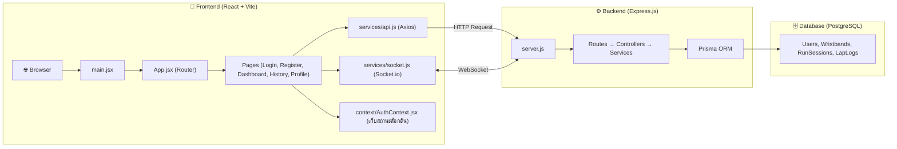
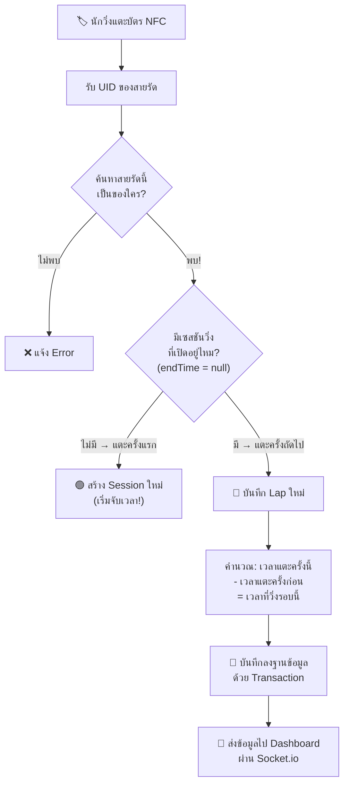
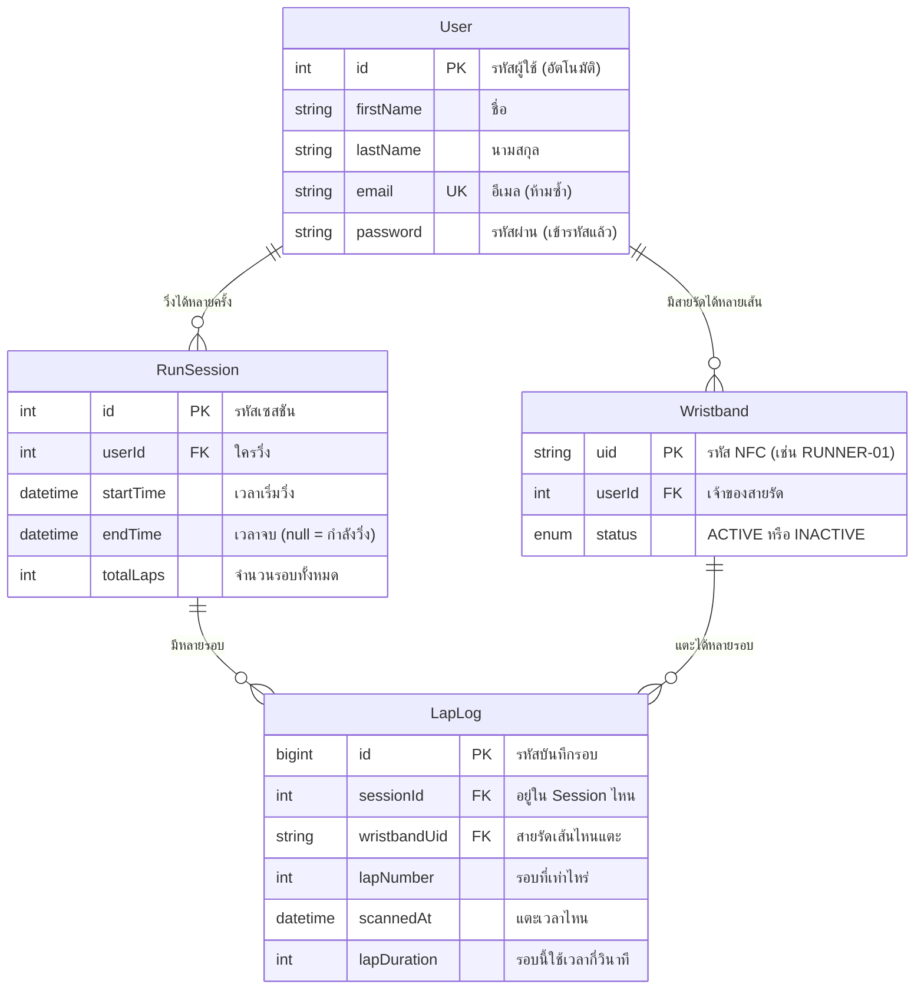
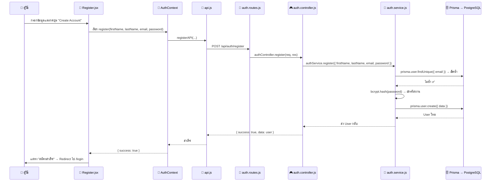
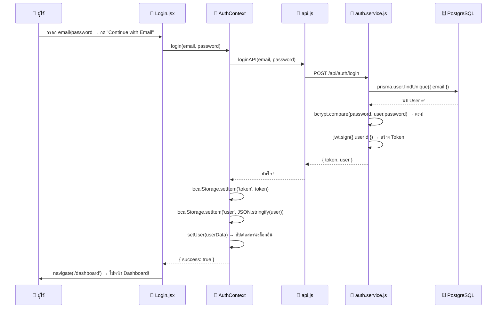
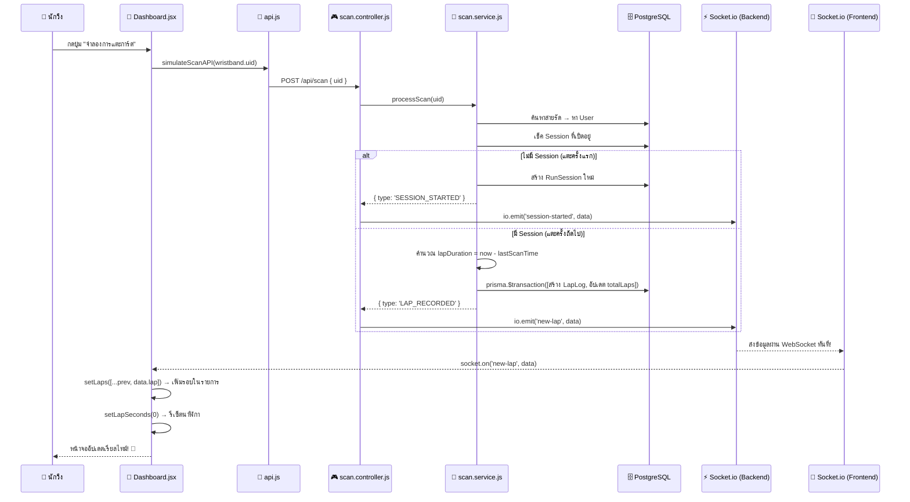

# 📖 คู่มือสอนอ่านโค้ด — The Park Run Tracker (ฉบับเต็ม)

> เอกสารนี้จะพาคุณเดินทางผ่านโค้ดทุกไฟล์ ทั้ง Backend และ Frontend ตั้งแต่จุดเริ่มต้น ไปจนถึงจุดปลายทาง เพื่อให้คุณเข้าใจว่า **"ข้อมูลเดินทางจากไหนไปไหน" และ "แต่ละไฟล์ทำหน้าที่อะไร"**

---

## 🗺️ ภาพรวมสถาปัตยกรรม (ดูให้เข้าใจก่อนอ่านโค้ด)



### หลักการง่ายๆ ในการอ่าน:
- **Frontend** = สิ่งที่ผู้ใช้เห็นและกดปุ่ม (React)
- **Backend** = เซิร์ฟเวอร์ที่ทำงานเบื้องหลัง (Express.js)
- **Database** = ฐานข้อมูลที่เก็บข้อมูลถาวร (PostgreSQL ผ่าน Prisma)
- ข้อมูลเดินทาง: **กดปุ่ม → api.js ยิง HTTP → server.js → route → controller → service → ฐานข้อมูล → ส่งกลับ**

---

# 🔵 ส่วนที่ 1: BACKEND — ทำงานอย่างไร

## 1.1 โครงสร้างโฟลเดอร์ Backend

```
backend/
├── server.js              ← 🚪 ประตูหน้า (Entry Point)
├── .env                   ← 🔑 รหัสลับ (ค่า Config ที่ไม่ควรเปิดเผย)
├── prisma/
│   └── schema.prisma      ← 📐 พิมพ์เขียวฐานข้อมูล (ตารางต่างๆ)
└── src/
    ├── config/
    │   ├── db.js           ← เชื่อมต่อฐานข้อมูล
    │   └── socket.js       ← ตั้งค่าช่องทางเรียลไทม์
    ├── routes/             ← 🚦 ป้ายบอกทาง (URL ไหน → ไปฟังก์ชันไหน)
    ├── controllers/        ← 🎮 ตัวควบคุม (รับ Request → เรียก Service → ส่ง Response)
    ├── services/           ← 🧠 สมอง (Business Logic ทั้งหมด)
    ├── middlewares/         ← 🛡️ ยาม (ตรวจสอบก่อนให้เข้า)
    └── utils/              ← 🧰 เครื่องมือช่วย (Response format, ค่าคงที่)
```

> [!TIP]
> **วิธีอ่าน Backend:** ทุก Request เริ่มจาก `server.js` → ผ่าน `Route` → เข้า `Controller` → เรียก `Service` → คุยกับ `Database (Prisma)` — จำไว้แค่นี้ก็อ่านโค้ดได้ทั้งระบบแล้วครับ

---

## 1.2 server.js — ประตูหน้า (จุดเริ่มต้นของทุกอย่าง)

📁 ไฟล์: [server.js](file:///c:/Users/Art/Desktop/The%20Park%20Run%20Tracker/backend/server.js)

```javascript
import express from 'express';        // ← ไลบรารีสร้างเว็บเซิร์ฟเวอร์
import { createServer } from 'http';  // ← สร้าง HTTP Server ชั้นล่าง (ให้ Socket.io ใช้)
import cors from 'cors';              // ← อนุญาตให้เว็บจากโดเมนอื่นเรียก API ได้
import dotenv from 'dotenv';          // ← โหลดค่า config จากไฟล์ .env

import { initSocket } from './src/config/socket.js';  // ← เปิดช่องทางเรียลไทม์

// Import Routes (ป้ายบอกทางทั้ง 4 ป้าย)
import authRoutes from './src/routes/auth.routes.js';         // /api/auth/*
import wristbandRoutes from './src/routes/wristband.routes.js'; // /api/wristband/*
import scanRoutes from './src/routes/scan.routes.js';         // /api/scan
import sessionRoutes from './src/routes/session.routes.js';   // /api/sessions/*

import { errorHandler } from './src/middlewares/error.middleware.js';

dotenv.config();                       // โหลดค่า .env ก่อนทุกอย่าง

const app = express();                 // สร้างแอป Express
const httpServer = createServer(app);  // ครอบด้วย HTTP Server
initSocket(httpServer);                // เปิดระบบ Socket.io บน Server ตัวนี้

app.use(cors());                       // เปิดให้ทุกโดเมนเข้าถึงได้
app.use(express.json());               // แปลง JSON ที่ส่งมาใน body ให้ใช้งานได้ (req.body)

// ── ติดป้ายบอกทาง (Routing) ──
app.use('/api/auth', authRoutes);         // URL ขึ้นต้น /api/auth → ไปไฟล์ auth.routes.js
app.use('/api/wristband', wristbandRoutes);
app.use('/api/scan', scanRoutes);
app.use('/api/sessions', sessionRoutes);

app.use(errorHandler);                 // ตัวดักจับ Error สุดท้าย (ต้องอยู่ท้ายสุด)

const PORT = process.env.PORT || 3000;
httpServer.listen(PORT, () => { ... }); // เริ่มรับ Request!
```

**เปรียบเทียบง่ายๆ:** `server.js` เหมือน **ล็อบบี้โรงแรม** — ลูกค้า (Request) เดินเข้ามา แล้วพนักงานต้อนรับจะชี้ทางว่า "ไปห้องสมัครสมาชิกทางนี้ครับ" "ไปห้องสแกนบัตรทางนี้ครับ"

---

## 1.3 Routes — ป้ายบอกทาง "URL ไหน → ไปฟังก์ชันไหน"

Routes ไม่มี Logic อะไรเลย แค่ **เชื่อม URL กับ Controller** เท่านั้น

### auth.routes.js — เส้นทางสมัคร/ล็อกอิน
📁 ไฟล์: [auth.routes.js](file:///c:/Users/Art/Desktop/The%20Park%20Run%20Tracker/backend/src/routes/auth.routes.js)

```javascript
router.post('/register', authController.register);  // POST /api/auth/register → สมัครสมาชิก
router.post('/login', authController.login);         // POST /api/auth/login → ล็อกอิน
```

### wristband.routes.js — เส้นทางจัดการสายรัด NFC
📁 ไฟล์: [wristband.routes.js](file:///c:/Users/Art/Desktop/The%20Park%20Run%20Tracker/backend/src/routes/wristband.routes.js)

```javascript
router.post('/assign', authenticate, wristbandController.assign);   // ผูกสายรัด (ต้องล็อกอินก่อน)
router.get('/:userId', authenticate, wristbandController.getByUser); // ดูสายรัดของ User
router.delete('/:uid', authenticate, wristbandController.remove);    // ลบสายรัด
```

> [!IMPORTANT]
> สังเกตคำว่า `authenticate` ตรงกลาง! นี่คือ **Middleware** (ยามเฝ้าประตู) — ถ้าไม่มี Token ก็เข้าไม่ได้ จะโดนส่งกลับพร้อมข้อความ "กรุณาเข้าสู่ระบบก่อน"

### scan.routes.js — เส้นทางรับข้อมูลสแกน NFC (หัวใจของระบบ)
📁 ไฟล์: [scan.routes.js](file:///c:/Users/Art/Desktop/The%20Park%20Run%20Tracker/backend/src/routes/scan.routes.js)

```javascript
router.post('/', scanController.processScan);  // POST /api/scan → ไม่ต้องล็อกอิน!
```

> **ทำไมไม่ต้องล็อกอิน?** เพราะเครื่องอ่าน NFC (ฮาร์ดแวร์) ส่งข้อมูลมาโดยตรง ไม่ได้เป็นคนที่กรอก Username/Password

### session.routes.js — เส้นทางดูประวัติการวิ่ง
📁 ไฟล์: [session.routes.js](file:///c:/Users/Art/Desktop/The%20Park%20Run%20Tracker/backend/src/routes/session.routes.js)

```javascript
router.get('/:userId', authenticate, sessionController.getSessionsByUser);      // ดูประวัติวิ่งทั้งหมด
router.get('/:sessionId/laps', authenticate, sessionController.getLapsBySession); // ดูเวลาแต่ละรอบ
router.post('/active/finish', authenticate, sessionController.finishActiveSession); // จบการวิ่ง
```

---

## 1.4 Controllers — ตัวควบคุม "รับ → ส่งต่อ → ตอบกลับ"

Controller ทำหน้าที่ 3 อย่างเท่านั้น:
1. **รับข้อมูล** จาก Request (req.body, req.params)
2. **ส่งต่อ** ให้ Service ทำงาน
3. **ส่งผลลัพธ์กลับ** ไปยัง Frontend

### auth.controller.js — ตัวอย่างฟังก์ชัน Register
📁 ไฟล์: [auth.controller.js](file:///c:/Users/Art/Desktop/The%20Park%20Run%20Tracker/backend/src/controllers/auth.controller.js)

```javascript
export const register = async (req, res, next) => {
  try {
    // 1. รับข้อมูล — ดึงจาก req.body ที่ Frontend ส่งมา
    const { firstName, lastName, email, password } = req.body;

    // 2. ตรวจสอบเบื้องต้น — กรอกครบไหม?
    if (!firstName || !lastName || !email || !password) {
      return error(res, ERROR_MSG.MISSING_FIELDS, HTTP_STATUS.BAD_REQUEST);
    }

    // 3. ส่งต่อให้ Service ทำงาน (สมัครสมาชิกจริงๆ)
    const user = await authService.register({ firstName, lastName, email, password });

    // 4. ส่งผลลัพธ์กลับ (สำเร็จ!)
    return success(res, user, SUCCESS_MSG.REGISTER_SUCCESS, HTTP_STATUS.CREATED);
  } catch (err) {
    next(err);  // ← ถ้าเกิด Error → ส่งไปให้ errorHandler จัดการ
  }
};
```

### scan.controller.js — ตัวควบคุมการสแกน NFC (สำคัญที่สุด!)
📁 ไฟล์: [scan.controller.js](file:///c:/Users/Art/Desktop/The%20Park%20Run%20Tracker/backend/src/controllers/scan.controller.js)

```javascript
export const processScan = async (req, res, next) => {
  try {
    const { uid, timestamp } = req.body;           // รับ UID ของสายรัดที่แตะ

    const result = await scanService.processScan(uid, timestamp);  // ส่งให้ Service คิด

    // ★ จุดสำคัญ: ส่งข้อมูลผ่าน Socket.io ไปยังหน้าจอ Dashboard ทันที!
    const io = getIO();

    if (result.type === 'SESSION_STARTED') {        // ถ้าเริ่มวิ่งครั้งแรก
      io.emit('session-started', result);           // → บอก Dashboard: "เริ่มวิ่งแล้ว!"
    }

    if (result.type === 'LAP_RECORDED') {           // ถ้าบันทึกรอบใหม่
      io.emit('new-lap', result);                   // → บอก Dashboard: "รอบใหม่มาแล้ว!"
    }
  } catch (err) {
    next(err);
  }
};
```

> [!TIP]
> `io.emit(...)` คือจุดที่ทำให้ระบบเป็น **Real-time** — ทันทีที่สแกนบัตร, Dashboard จะอัปเดตโดยไม่ต้องกดรีเฟรชหน้าจอ!

---

## 1.5 Services — สมอง "Business Logic ทั้งหมดอยู่ที่นี่"

Service คือชั้นที่ **คิดหนักที่สุด**: คำนวณ, ตรวจสอบเงื่อนไข, อ่าน/เขียนฐานข้อมูล

### auth.service.js — ล็อกอินทำงานยังไง?
📁 ไฟล์: [auth.service.js](file:///c:/Users/Art/Desktop/The%20Park%20Run%20Tracker/backend/src/services/auth.service.js)

```javascript
export const login = async ({ email, password }) => {
  // ── ขั้นที่ 1: หา User จาก email ──
  const user = await prisma.user.findUnique({      // ค้นหาจากฐานข้อมูล
    where: { email },
  });

  if (!user) { throw new Error('อีเมลหรือรหัสผ่านไม่ถูกต้อง'); }

  // ── ขั้นที่ 2: เช็ครหัสผ่าน ──
  const isPasswordValid = await bcrypt.compare(    // เทียบรหัสที่กรอก กับรหัสที่เข้ารหัสไว้
    password,       // รหัสที่ผู้ใช้กรอก
    user.password   // รหัสที่เข้ารหัสเก็บไว้ในฐานข้อมูล
  );

  if (!isPasswordValid) { throw new Error('อีเมลหรือรหัสผ่านไม่ถูกต้อง'); }

  // ── ขั้นที่ 3: สร้าง JWT Token (บัตรผ่าน) ──
  const token = jwt.sign(
    { userId: user.id, email: user.email },         // ข้อมูลที่ฝังไว้ใน Token
    process.env.JWT_SECRET,                         // กุญแจลับสำหรับเข้ารหัส
    { expiresIn: '7d' }                             // หมดอายุใน 7 วัน
  );

  // ── ส่ง Token + ข้อมูล User กลับไป ──
  return { token, user: { id, firstName, lastName, email } };
};
```

**เปรียบเทียบง่ายๆ:**
- `bcrypt.compare()` = เหมือนเอาลูกกุญแจไปลองไขกับรูกุญแจ ถ้าตรงกันก็เปิดได้
- `jwt.sign()` = เหมือนประทับตรา **"คนนี้ผ่านการตรวจสอบแล้ว"** บนบัตรผ่าน แล้วส่งบัตรให้เขาไปถืออยู่ 7 วัน

---

### scan.service.js — หัวใจหลักของระบบทั้งหมด ⭐
📁 ไฟล์: [scan.service.js](file:///c:/Users/Art/Desktop/The%20Park%20Run%20Tracker/backend/src/services/scan.service.js)

นี่คือไฟล์ที่สำคัญที่สุด ทำงานทุกครั้งที่นักวิ่งแตะบัตร NFC:



ลองอ่านโค้ดจริงตามแผนภาพด้านบน:

```javascript
export const processScan = async (uid, timestamp) => {

  // ── ขั้นที่ 1: ค้นหาสายรัดข้อมือ → หาว่าเป็นของ User คนไหน ──
  const wristband = await prisma.wristband.findUnique({
    where: { uid },           // ค้นหาจากรหัส NFC UID
    include: { user: true },  // ดึงข้อมูล User ที่เป็นเจ้าของมาด้วย
  });

  // ── ขั้นที่ 2: เช็คว่ามี Session วิ่งที่เปิดอยู่ไหม ──
  const activeSession = await prisma.runSession.findFirst({
    where: {
      userId,
      endTime: null,          // endTime = null หมายความว่ายังไม่จบ → กำลังวิ่งอยู่
    },
    include: {
      lapLogs: {
        orderBy: { lapNumber: 'desc' },
        take: 1,              // ดึงเฉพาะ Lap ล่าสุดมา 1 รายการ
      },
    },
  });

  // ── กรณี A: ไม่มี Session → แตะครั้งแรก → เริ่มวิ่ง! ──
  if (!activeSession) {
    const newSession = await prisma.runSession.create({
      data: { userId, startTime: now.toDate() },  // จดเวลาเริ่มต้น
    });
    return { type: 'SESSION_STARTED', session: newSession, user: {...} };
  }

  // ── กรณี B: มี Session อยู่แล้ว → บันทึกรอบใหม่ ──

  // คำนวณเวลาที่วิ่งรอบนี้
  const lastLap = activeSession.lapLogs[0];                     // Lap ล่าสุดที่เคยบันทึก
  const previousTime = lastLap
    ? dayjs(lastLap.scannedAt)          // ถ้ามี Lap ก่อนหน้า → เทียบกับเวลาแตะครั้งก่อน
    : dayjs(activeSession.startTime);   // ถ้าไม่มี (Lap แรก) → เทียบกับเวลาเริ่มวิ่ง

  const lapDuration = now.diff(previousTime, 'second');  // ← ผลต่าง = เวลาที่วิ่งรอบนี้ (วินาที)

  // บันทึกลงฐานข้อมูลแบบ Transaction (เกิดพร้อมกัน 100% หรือไม่เกิดเลย)
  const [lapLog, updatedSession] = await prisma.$transaction([
    prisma.lapLog.create({ ... }),         // สร้างบันทึกรอบใหม่
    prisma.runSession.update({ ... }),     // อัปเดตจำนวนรอบรวม +1
  ]);

  return { type: 'LAP_RECORDED', lap: {...}, session: {...}, user: {...} };
};
```

> [!IMPORTANT]
> **`prisma.$transaction([])`** คืออะไร?
> เป็นการรันคำสั่งหลายอันพร้อมกันแบบ **"สำเร็จทั้งหมด หรือ ยกเลิกทั้งหมด"** เช่น ถ้าสร้าง LapLog สำเร็จ แต่อัปเดต totalLaps ล้มเหลว → ระบบจะยกเลิก LapLog ที่พึ่งสร้างด้วย ป้องกันข้อมูลเพี้ยน

---

## 1.6 Middlewares — ยามเฝ้าประตู

### auth.middleware.js — ตรวจสอบบัตรผ่าน (JWT Token)
📁 ไฟล์: [auth.middleware.js](file:///c:/Users/Art/Desktop/The%20Park%20Run%20Tracker/backend/src/middlewares/auth.middleware.js)

```javascript
export const authenticate = (req, res, next) => {
  // 1. ดึง Token จาก Header ของ Request
  const authHeader = req.headers.authorization;
  //    ↑ Frontend ส่งมาในรูปแบบ: "Bearer eyJhbGci..."

  // 2. ตรวจว่ามี Token มาไหม
  if (!authHeader || !authHeader.startsWith('Bearer ')) {
    return error(res, 'กรุณาเข้าสู่ระบบก่อน', 401);
  }

  // 3. แยกเอาเฉพาะ Token (ตัด "Bearer " ออก)
  const token = authHeader.split(' ')[1];

  // 4. ถอดรหัส Token → ได้ข้อมูล userId กลับมา
  const decoded = jwt.verify(token, process.env.JWT_SECRET);

  // 5. แปะข้อมูล user ไว้ใน Request → ให้ Controller ใช้ต่อ
  req.user = decoded;
  next();  // ← ผ่าน! ไปต่อได้
};
```

**เปรียบเทียบง่ายๆ:** เหมือน **รปภ. ตรวจบัตรพนักงาน** — ถ้าแสดงบัตรที่ถูกต้อง ก็ผ่านไปได้ ถ้าไม่มีบัตร ก็ห้ามเข้า

### error.middleware.js — ตัวดักจับ Error กลาง
📁 ไฟล์: [error.middleware.js](file:///c:/Users/Art/Desktop/The%20Park%20Run%20Tracker/backend/src/middlewares/error.middleware.js)

ทุกครั้งที่มี `next(err)` ใน Controller → Error จะถูกส่งมาที่นี่:

```javascript
export const errorHandler = (err, req, res, next) => {
  console.error('❌ Error:', err.message);
  return res.status(err.statusCode || 500).json({
    success: false,
    message: err.message || 'เกิดข้อผิดพลาดภายในระบบ',
    data: null,
  });
};
```

---

## 1.7 Config & Utils — เครื่องมือช่วย

### db.js — เชื่อมต่อฐานข้อมูล (สั้นมาก แค่ 3 บรรทัด!)
📁 ไฟล์: [db.js](file:///c:/Users/Art/Desktop/The%20Park%20Run%20Tracker/backend/src/config/db.js)

```javascript
import { PrismaClient } from '@prisma/client';
const prisma = new PrismaClient();   // สร้างตัวเชื่อมต่อฐานข้อมูล
export default prisma;                // ส่งออกให้ทุก Service ใช้ร่วมกัน
```

### socket.js — ตั้งค่าช่องทาง Real-time
📁 ไฟล์: [socket.js](file:///c:/Users/Art/Desktop/The%20Park%20Run%20Tracker/backend/src/config/socket.js)

```javascript
let io;  // ตัวแปรเก็บ Socket.io instance (มีตัวเดียวทั้งระบบ)

export const initSocket = (httpServer) => {
  io = new Server(httpServer, { cors: { origin: '*' } });  // สร้างช่อง WebSocket

  io.on('connection', (socket) => {
    console.log('🟢 ผู้ใช้เชื่อมต่อแล้ว:', socket.id);
  });
};

export const getIO = () => io;  // ← Controller เรียกฟังก์ชันนี้เพื่อส่งข้อมูลไป Frontend
```

### apiResponse.js — ส่ง Response แบบมาตรฐาน
📁 ไฟล์: [apiResponse.js](file:///c:/Users/Art/Desktop/The%20Park%20Run%20Tracker/backend/src/utils/apiResponse.js)

```javascript
// Response สำเร็จ → ทุกครั้งจะมีหน้าตาเหมือนกัน
export const success = (res, data, message = 'Success', statusCode = 200) => {
  return res.status(statusCode).json({ success: true, message, data });
};

// Response ผิดพลาด
export const error = (res, message = 'Error', statusCode = 500) => {
  return res.status(statusCode).json({ success: false, message, data: null });
};
```

> **ทำไมต้องมี?** เพื่อให้ **ทุก API ส่งข้อมูลกลับในรูปแบบเดียวกัน** — Frontend รู้เลยว่าต้องเช็ค `response.success` เป็น true หรือ false

### constants.js — ค่าคงที่ (ข้อความ Error/Success ทุกตัว)
📁 ไฟล์: [constants.js](file:///c:/Users/Art/Desktop/The%20Park%20Run%20Tracker/backend/src/utils/constants.js)

```javascript
export const SALT_ROUNDS = 10;        // ความยากในการเข้ารหัสรหัสผ่าน
export const TOKEN_EXPIRY = '7d';     // JWT หมดอายุใน 7 วัน

export const ERROR_MSG = {
  EMAIL_ALREADY_EXISTS: 'อีเมลนี้ถูกใช้งานแล้ว',
  INVALID_CREDENTIALS: 'อีเมลหรือรหัสผ่านไม่ถูกต้อง',
  // ... ข้อความ Error อื่นๆ
};

export const SUCCESS_MSG = {
  REGISTER_SUCCESS: 'สมัครสมาชิกสำเร็จ',
  LOGIN_SUCCESS: 'เข้าสู่ระบบสำเร็จ',
  // ...
};
```

---

## 1.8 Database Schema (Prisma) — พิมพ์เขียวฐานข้อมูล

📁 ไฟล์: [schema.prisma](file:///c:/Users/Art/Desktop/The%20Park%20Run%20Tracker/backend/prisma/schema.prisma)



---

# 🟢 ส่วนที่ 2: FRONTEND — ทำงานอย่างไร

## 2.1 โครงสร้างโฟลเดอร์ Frontend

```
frontend/src/
├── main.jsx            ← 🚪 จุดเริ่มต้น (Render App ลงใน HTML)
├── App.jsx             ← 🗺️ แผนที่เส้นทาง (Router)
├── index.css           ← 🎨 ธีมสีและ Global Styles
├── context/
│   └── AuthContext.jsx ← 🧠 สถานะล็อกอิน (เก็บ user, token, wristband)
├── services/
│   ├── api.js          ← 📡 ตัวส่ง HTTP Request ไป Backend
│   └── socket.js       ← 🔌 ตัวเชื่อมต่อ WebSocket
├── components/
│   ├── TopAppBar.jsx   ← แถบด้านบน
│   └── BottomNavBar.jsx← แถบเมนูด้านล่าง
└── pages/
    ├── Login.jsx       ← หน้าล็อกอิน
    ├── Register.jsx    ← หน้าสมัคร
    ├── Dashboard.jsx   ← หน้าจับเวลาเรียลไทม์ ⭐
    ├── History.jsx     ← หน้าประวัติ
    └── Profile.jsx     ← หน้าโปรไฟล์
```

---

## 2.2 main.jsx → App.jsx — จุดเริ่มต้น

### main.jsx — จุดเริ่มต้นสุดแรก (แค่ 4 บรรทัดสำคัญ)
📁 ไฟล์: [main.jsx](file:///c:/Users/Art/Desktop/The%20Park%20Run%20Tracker/frontend/src/main.jsx)

```javascript
import App from './App.jsx'

createRoot(document.getElementById('root'))  // หา <div id="root"> ใน index.html
  .render(<App />)                           // แล้วยัดแอปทั้งหมดลงไป
```

### App.jsx — เส้นทางทั้งหมดของแอป
📁 ไฟล์: [App.jsx](file:///c:/Users/Art/Desktop/The%20Park%20Run%20Tracker/frontend/src/App.jsx)

```javascript
function App() {
  return (
    <AuthProvider>              {/* ← ครอบทุกหน้าด้วยระบบจัดการล็อกอิน */}
      <BrowserRouter>           {/* ← เปิดระบบเส้นทาง URL */}
        <Routes>
          {/* หน้าที่ไม่ต้องล็อกอิน */}
          <Route path="/login" element={<Login />} />
          <Route path="/register" element={<Register />} />

          {/* หน้าที่ต้องล็อกอินก่อน — ถ้ายังไม่ล็อกอินจะถูกดีดกลับไป /login */}
          <Route path="/dashboard" element={
            <ProtectedRoute><Dashboard /></ProtectedRoute>
          } />
          <Route path="/history" element={
            <ProtectedRoute><History /></ProtectedRoute>
          } />
          <Route path="/profile" element={
            <ProtectedRoute><Profile /></ProtectedRoute>
          } />

          {/* ถ้าเข้า URL อื่น → ไป Dashboard อัตโนมัติ */}
          <Route path="*" element={<Navigate to="/dashboard" />} />
        </Routes>
      </BrowserRouter>
    </AuthProvider>
  );
}
```

> **ProtectedRoute** คือ Component ที่เช็คว่า `isAuthenticated === true` ไหม ถ้าไม่ → `<Navigate to="/login" />` (ดีดกลับหน้าล็อกอิน)

---

## 2.3 AuthContext.jsx — สมองของ Frontend (เก็บสถานะล็อกอิน)

📁 ไฟล์: [AuthContext.jsx](file:///c:/Users/Art/Desktop/The%20Park%20Run%20Tracker/frontend/src/context/AuthContext.jsx)

ไฟล์นี้เก็บข้อมูล 3 อย่างที่ **ทุกหน้าสามารถเข้าถึงได้**:

```javascript
const [user, setUser] = useState(null);          // ข้อมูลผู้ใช้ (ชื่อ, email, id)
const [wristband, setWristband] = useState(null); // ข้อมูลสายรัด NFC
const [loading, setLoading] = useState(true);     // กำลังโหลดอยู่ไหม

// ─── ฟังก์ชันที่ทุกหน้าเรียกใช้ได้ ───
const login = async (email, password) => { ... };     // เรียก API ล็อกอิน → เก็บ Token
const register = async (...) => { ... };               // เรียก API สมัคร
function logout() { ... };                              // ลบ Token → ออกจากระบบ

// ─── แจกข้อมูลให้ทุกหน้า ───
return (
  <AuthContext.Provider value={{
    user,                    // ข้อมูล User ปัจจุบัน
    wristband,               // ข้อมูลสายรัด NFC
    isAuthenticated: !!user, // true ถ้าล็อกอินอยู่
    login, register, logout, // ฟังก์ชันต่างๆ
  }}>
    {children}               {/* ← ทุกหน้าจอที่อยู่ข้างใน */}
  </AuthContext.Provider>
);
```

**วิธีใช้ในหน้าต่างๆ:** แค่เขียน `const { user, login, logout } = useAuth();` แล้วก็ใช้ได้เลย!

---

## 2.4 services/api.js — ตัวส่งข้อมูลไป Backend

📁 ไฟล์: [api.js](file:///c:/Users/Art/Desktop/The%20Park%20Run%20Tracker/frontend/src/services/api.js)

```javascript
// ─── ตั้งค่า Base URL (ชี้ไปที่ Backend) ───
const API_URL = import.meta.env.VITE_API_URL || 'http://localhost:3000/api';

const api = axios.create({ baseURL: API_URL });

// ─── Interceptor: แนบ Token ไปกับทุก Request อัตโนมัติ ───
api.interceptors.request.use((config) => {
  const token = localStorage.getItem('token');
  if (token) {
    config.headers.Authorization = `Bearer ${token}`;  // ← แนบบัตรผ่านไปด้วยทุกครั้ง!
  }
  return config;
});

// ─── ฟังก์ชันสำหรับเรียก API ───
export const loginAPI = (email, password) =>
  api.post('/auth/login', { email, password });          // → POST /api/auth/login

export const registerAPI = (firstName, lastName, email, password) =>
  api.post('/auth/register', { firstName, lastName, email, password });

export const simulateScanAPI = (uid) =>
  api.post('/scan', { uid });                            // → POST /api/scan

export const getSessionsAPI = (userId) =>
  api.get(`/sessions/${userId}`);                        // → GET /api/sessions/1

export const finishSessionAPI = () =>
  api.post('/sessions/active/finish');                    // → POST /api/sessions/active/finish
```

> **Interceptor** คืออะไร? เหมือน **ยามที่แปะบัตรผ่านให้ทุกคนก่อนออกจากตึก** — ทุก Request ที่ส่งไป Backend จะมี Token ติดไปด้วยอัตโนมัติ ไม่ต้องใส่เองทุกครั้ง

---

## 2.5 services/socket.js — ช่องทาง Real-time

📁 ไฟล์: [socket.js](file:///c:/Users/Art/Desktop/The%20Park%20Run%20Tracker/frontend/src/services/socket.js)

```javascript
const SOCKET_URL = import.meta.env.VITE_SOCKET_URL || 'http://localhost:3000';

let socket = null;

export const initiateSocketConnection = () => {
  if (!socket) {
    socket = io(SOCKET_URL, {
      autoConnect: false,             // ไม่เชื่อมต่ออัตโนมัติ (รอให้ Dashboard สั่ง)
      reconnectionAttempts: 5,        // ถ้าหลุด ลองเชื่อมใหม่ 5 ครั้ง
    });
  }
  return socket;
};
```

---

## 2.6 Pages — หน้าจอต่างๆ

### Login.jsx — หน้าล็อกอิน
📁 ไฟล์: [Login.jsx](file:///c:/Users/Art/Desktop/The%20Park%20Run%20Tracker/frontend/src/pages/Login.jsx)

```javascript
const Login = () => {
  const [email, setEmail] = useState('');
  const [password, setPassword] = useState('');
  const { login } = useAuth();          // ← ดึงฟังก์ชัน login จาก AuthContext
  const navigate = useNavigate();

  const handleSubmit = async (e) => {
    e.preventDefault();
    const result = await login(email, password);  // ← เรียก API ล็อกอิน
    if (result.success) {
      navigate('/dashboard');            // ← ล็อกอินสำเร็จ → ไปหน้า Dashboard!
    } else {
      setErrorMsg(result.message);       // ← ล้มเหลว → แสดงข้อความ Error
    }
  };

  return (
    <form onSubmit={handleSubmit}>
      <input type="email" value={email} onChange={(e) => setEmail(e.target.value)} />
      <input type="password" value={password} onChange={(e) => setPassword(e.target.value)} />
      <button type="submit">Continue with Email</button>
    </form>
  );
};
```

### Dashboard.jsx — หน้าจับเวลาเรียลไทม์ ⭐ (สำคัญที่สุด!)
📁 ไฟล์: [Dashboard.jsx](file:///c:/Users/Art/Desktop/The%20Park%20Run%20Tracker/frontend/src/pages/Dashboard.jsx)

Dashboard ทำงาน 3 อย่างหลัก:

#### 1. โหลดเซสชันปัจจุบัน (useEffect ตัวที่ 1)
```javascript
useEffect(() => {
  const fetchActiveSession = async () => {
    const res = await getSessionsAPI(user.id);        // ดึงประวัติวิ่งทั้งหมด
    const latest = res.data[0];                       // เอาตัวล่าสุด
    if (latest.endTime === null) {                    // ถ้ายังไม่จบ → กำลังวิ่งอยู่!
      setActiveSession(latest);                       // เก็บข้อมูลเซสชัน
      const lapsRes = await getSessionLapsAPI(latest.id);  // ดึงรอบวิ่งทั้งหมด
      setLaps(lapsRes.data.laps);                     // เก็บข้อมูลรอบ
    }
  };
  fetchActiveSession();
}, [user]);
```

#### 2. ฟังอีเวนต์ Socket.io (useEffect ตัวที่ 2)
```javascript
useEffect(() => {
  const socket = initiateSocketConnection();
  socket.connect();                                   // เชื่อมต่อ WebSocket

  socket.on('session-started', (data) => {            // ← เมื่อเริ่มวิ่ง
    if (data.user?.id === user.id) {
      setActiveSession(data.session);                 // อัปเดตหน้าจอทันที!
    }
  });

  socket.on('new-lap', (data) => {                    // ← เมื่อแตะรอบใหม่
    if (data.user?.id === user.id) {
      setLaps((prev) => [...prev, data.lap]);         // เพิ่มรอบใหม่ลงใน List
      setLapSeconds(0);                               // รีเซ็ตนาฬิกาจับเวลารอบ
    }
  });

  socket.on('session-finished', (data) => {           // ← เมื่อจบการวิ่ง
    setActiveSession(null);                           // หยุดแสดงหน้าจอวิ่ง
  });
}, [user]);
```

#### 3. นาฬิกาจับเวลา (useEffect ตัวที่ 3)
```javascript
useEffect(() => {
  if (activeSession) {
    timerRef.current = setInterval(() => {
      setLapSeconds((prev) => prev + 1);              // นับ +1 วินาทีทุกวินาที
    }, 1000);
  }
  return () => clearInterval(timerRef.current);        // หยุดนับเมื่อจบ
}, [activeSession]);
```

---

# 🔄 ส่วนที่ 3: ตามรอยข้อมูล — จาก "กดปุ่ม" ถึง "แสดงผล"

## Flow ที่ 1: สมัครสมาชิก



## Flow ที่ 2: ล็อกอิน



## Flow ที่ 3: สแกน NFC → Dashboard อัปเดตเรียลไทม์ ⭐



---

# 🎨 ส่วนที่ 4: ระบบธีมสี & Styling

📁 ไฟล์: [index.css](file:///c:/Users/Art/Desktop/The%20Park%20Run%20Tracker/frontend/src/index.css)

```css
:root {
  --color-primary: #f97316;         /* สีส้ม (สีหลัก) */
  --color-bg: #0f172a;              /* พื้นหลังสีน้ำเงินเข้ม */
  --color-surface: #1e293b;         /* พื้นผิวการ์ด */
  --color-text: #e2e8f0;            /* สีตัวหนังสือ */
  --color-error: #f87171;           /* สีแดง (Error) */
  --color-success: #4ade80;         /* สีเขียว (สำเร็จ) */
}

/* glass-card = เอฟเฟกต์กระจกฝ้า (ใช้ทุกหน้า) */
.glass-card {
  background: rgba(30, 41, 59, 0.45);  /* พื้นหลังโปร่งแสง */
  backdrop-filter: blur(20px);          /* เบลอพื้นหลัง */
  border: 1px solid rgba(255, 255, 255, 0.08);
}
```

แต่ละหน้าจะมี CSS Module แยกของตัวเอง เช่น `Dashboard.module.css` ทำให้สไตล์ไม่ซ้อนทับกัน

---

# 📋 สรุปทั้งหมด — ตารางเทียบไฟล์ Backend ↔ Frontend

| การกระทำของผู้ใช้ | Frontend (ไฟล์ที่ทำงาน) | API ที่เรียก | Backend Route → Controller → Service |
|:---|:---|:---|:---|
| **กดสมัครสมาชิก** | Register.jsx → AuthContext | `POST /api/auth/register` | auth.routes → auth.controller → auth.service |
| **กดเข้าสู่ระบบ** | Login.jsx → AuthContext | `POST /api/auth/login` | auth.routes → auth.controller → auth.service |
| **ผูกสายรัด NFC** | Profile.jsx → api.js | `POST /api/wristband/assign` | wristband.routes → wristband.controller → wristband.service |
| **กดจำลองสแกน** | Dashboard.jsx → api.js | `POST /api/scan` | scan.routes → scan.controller → scan.service |
| **ดูประวัติวิ่ง** | History.jsx → api.js | `GET /api/sessions/:userId` | session.routes → session.controller → session.service |
| **ดูเวลาแต่ละรอบ** | History.jsx → api.js | `GET /api/sessions/:id/laps` | session.routes → session.controller → session.service |
| **กดจบการวิ่ง** | Dashboard.jsx → api.js | `POST /api/sessions/active/finish` | session.routes → session.controller → session.service |

> [!TIP]
> **หลักการจำง่ายๆ:** ทุก Flow ผ่าน **4 ชั้น** เสมอ → `Route → Controller → Service → Database` — ถ้าอาจารย์ถามว่า "ข้อมูลไปไหน" ให้ตอบตามลำดับนี้ได้เลยครับ!
